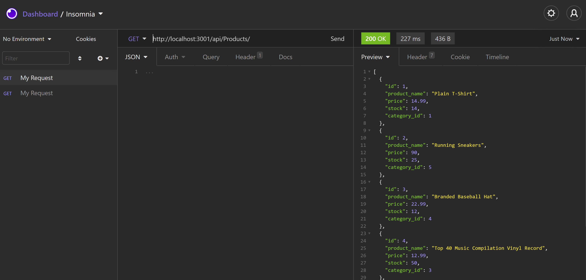

# E_Commerce_BackEnd

This project is a demonstration of viewing and manipulating data in a SQL database with the app. Insomnia using Node.js and Sequalize.
With Insomnia you are able to:

- Use a GET request to view data in a table
- Use a POST request to add a new record in a table
- Use a PUT request to edit a record in a table
- Use a DELETE request to delete a record from a table

Github
[URL] (https://github.com/bmowrey729/E_Commerce_BackEnd)

Video
[URL] (https://drive.google.com/file/d/1N46QRMT2odwoxoF5iKfPZyv4IcqlSPbK/view)

